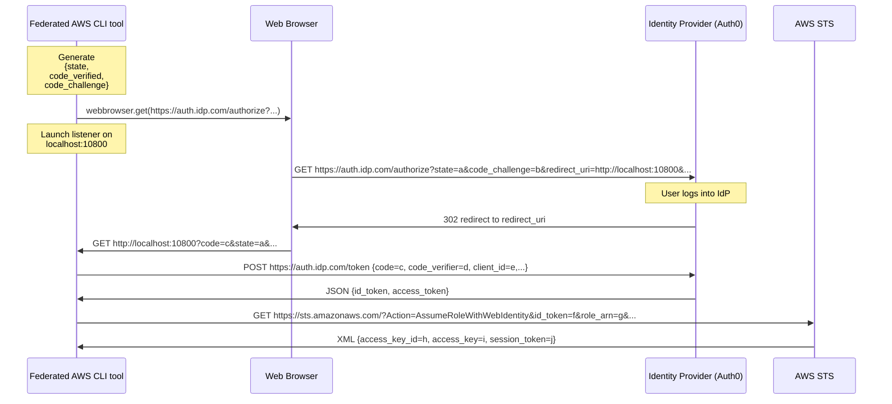

```mermaid
sequenceDiagram

participant CLI as Federated AWS CLI tool
participant B as Web Browser
participant IdP as Identity Provider (Auth0)
participant STS as AWS STS

Note over CLI: Generate<br/>{state,<br/>code_verified,<br/> code_challenge}
CLI->>B: webbrowser.get(https://auth.idp.com/authorize?...)
Note over CLI: Launch listener on<br/>localhost:10800
B->>IdP: GET https://auth.idp.com/authorize?state=a&code_challenge=b&redirect_uri=http://localhost:10800&...
Note over IdP: User logs into IdP
IdP->>B: 302 redirect to redirect_uri
B->>CLI: GET http://localhost:10800?code=c&state=a&...
CLI->>IdP: POST https://auth.idp.com/token {code=c, code_verifier=d, client_id=e,...}
IdP->>CLI: JSON {id_token, access_token}
CLI->>STS: GET https://sts.amazonaws.com/?Action=AssumeRoleWithWebIdentity&id_token=f&role_arn=g&...
STS->>CLI: XML {access_key_id=h, access_key=i, session_token=j}
```
