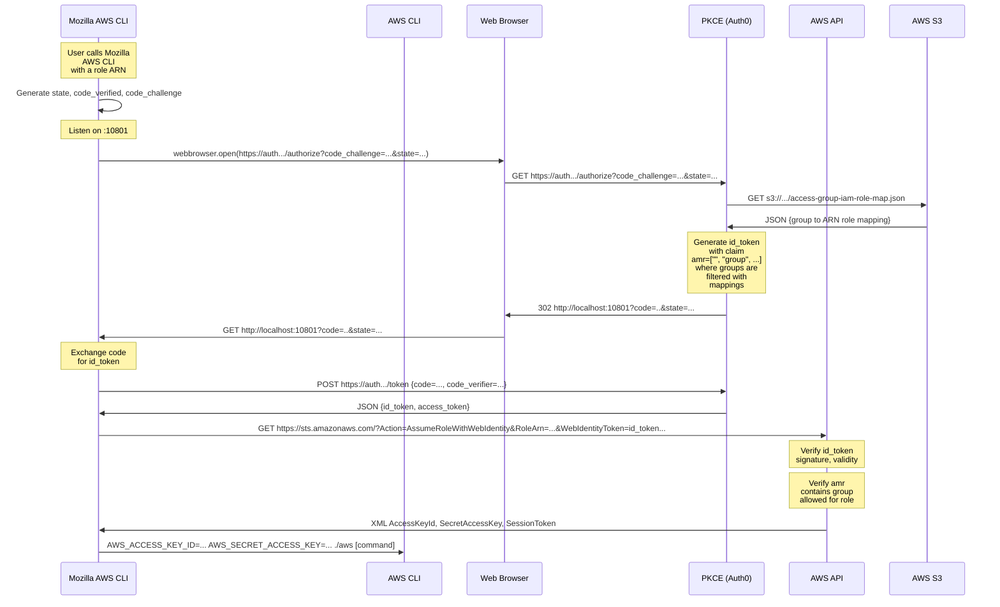

```mermaid
sequenceDiagram

participant FCLI as Mozilla AWS CLI
participant ACLI as AWS CLI
participant WB as Web Browser
participant PKCE as PKCE (Auth0)
participant AWS as AWS API
participant S3 as AWS S3

Note over FCLI: User calls Mozilla <br>AWS CLI<br>with a role ARN
FCLI->>FCLI: Generate state, code_verified, code_challenge
note over FCLI: Listen on :10801
FCLI->>WB: webbrowser.open(https://auth.../authorize?code_challenge=...&state=...)
WB->>PKCE: GET https://auth.../authorize?code_challenge=...&state=...
PKCE->>S3: GET s3://.../access-group-iam-role-map.json
S3->>PKCE: JSON {group to ARN role mapping}

note over PKCE: Generate id_token <br>with claim <br>amr=["", "group", ...]<br>where groups are <br>filtered with<br>mappings
PKCE->>WB: 302 http://localhost:10801?code=..&state=...
WB->>FCLI: GET http://localhost:10801?code=..&state=...

note over FCLI: Exchange code<br> for id_token
FCLI->>PKCE: POST https://auth.../token {code=..., code_verifier=...}
PKCE->>FCLI: JSON {id_token, access_token}
FCLI->>AWS:  GET https://sts.amazonaws.com/?Action=AssumeRoleWithWebIdentity&RoleArn=...&WebIdentityToken=id_token...
note over AWS: Verify id_token <br>signature, validity
note over AWS: Verify amr<br>contains group<br>allowed for role
AWS->>FCLI: XML AccessKeyId, SecretAccessKey, SessionToken

FCLI->>ACLI: AWS_ACCESS_KEY_ID=... AWS_SECRET_ACCESS_KEY=... ./aws [command]
```
